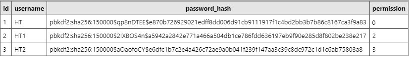
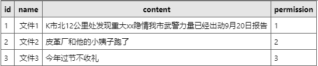
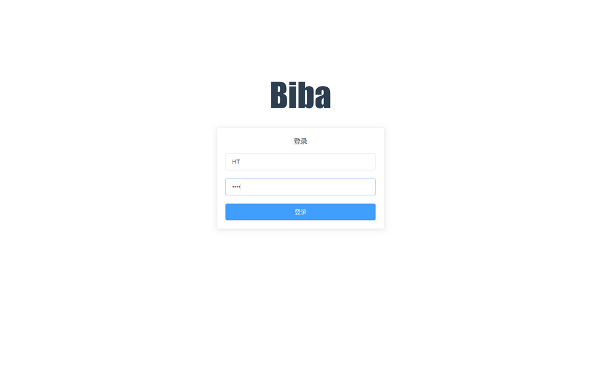
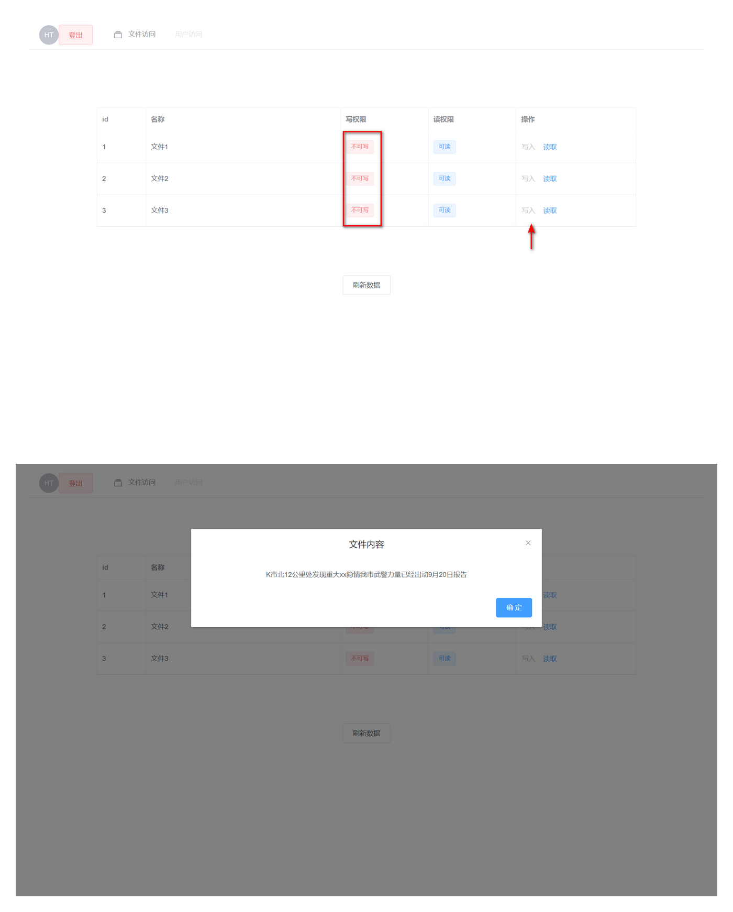
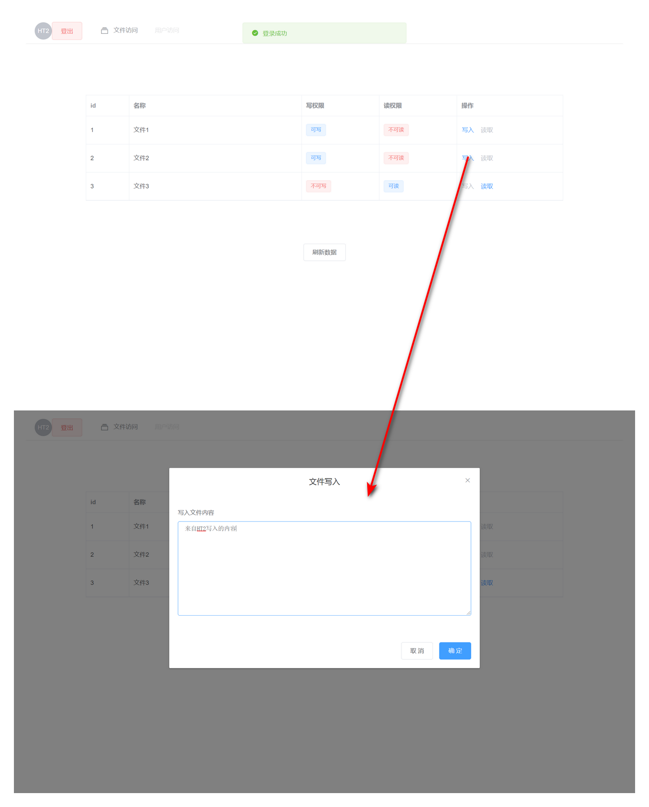
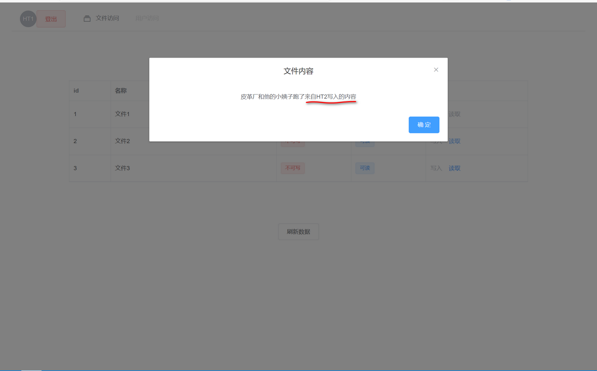

### Biba模型模拟

> 对完整性安全模型biba的模拟实现
>
> 技术栈：Flask+Vue(element)

[TOC]


#### 一. Biba模型概念

##### 1. 背景信息

> BLP模型保证的是数据机密性，是军事安全模型。而商业应用中人们往往关心的是数据的完整性。

- Biba等人
- 1977年提出的第一个完整性安全模型

##### 2.简单介绍

- 为系统中每一个**主体**和**客体**分配一个完整性等级
- 完整性等级越高，可靠性越高
- <u>高</u>等级数据**精确性**与**可靠性**><u>低</u>等级数据

##### 3. 三种策略

###### 3.1 下限标记策略

- 主体下限标记策略
  1. 主体**S**可**写**客体**O**     <=>    S等级>O等级
  2. 主体**S**读取完客体**O**后 ，S完整新=**最小上界**（S读取前，O）
  3. 主体**S1**可执行主体**S2**   <=> S1等级>s2等级

- 客体下限标记策略
  1. 写操作后，O完整性=**最大下界**（S写前，O）

###### 3.2 环策略

- S可以**写**O  <=> S>O
- S1**执行**S2 <=> S2>S1
- S可**读**任何O

###### 3.3 严格完整性策略

- 完整性*-属性：主体S可以**写**客体O  <=> S等级>O等级
- 援引规则：       主体S1可以**执行**主体S2   <=> S1等级>S2等级
- 简单完整性规则：主体S可以**读**客体O  <=>   S等级<O等级

#### 二.biba模型设计

> 使用严格完整性策略

##### 总体设计

- 采用前后端分离的架构
  - 前端进行操作（登录，登出，读取文件，浏览文件，写文件等）
  - 后端提供认证服务，用户管理服务，文件读写服务
- 用户认证
  - 第一次登录的时候使用用户名和密码登录，之后获得一个token
  - 之后前端的每次操作必须验证其token

**数据库设计**

- 用户S

  - username 用户名
  - password_hash hash过的用户密码
  - permision 用户的等级

  

- 文件O

  - name 文件名
  - content 文件的内容
  - permision 文件的等级

  

#### 三. biba模型关键代码

##### 用户认证

```python
@blue.route('/api/objects/<int:id>',methods=['GET','POST'])
@auth.login_required  #访问资源必须要求已经登录
def get_object_content(id):
    xxxxxxx
```

##### 读写权限判断

###### 后端获取资源接口

```python
@blue.route('/api/objects',methods=['GET'])
@auth.login_required
def get_objects():
    ''' 获得所有对象 '''
    S=g.user  #主体等级
    objects=Object.query.all() #获得所有客体资源

    data=[]
    for O in objects:
        writeable = True if S.permission>O.permission  else False   #如果主体的等级大于客体等级 则可写 否则不可写
        readable  = True if S.permission<=O.permission else False   #如果主体的等级小于等于客体等级 则可读 否则不可读
        data.append({'id':O.id,'name':O.name,'w':writeable,'r':readable})

    return jsonify({"status":"OK","data":data})
```

###### 前端展示界面

```js
<template slot-scope="scope">
    <!-- 只有可写权限 用户才可以写-->
    <el-button v-if="scope.row.w" type="text" @click="dialogFormVisible = true;writeid=scope.row.id">写入</el-button>
	<el-button v-else type="text" disabled>写入</el-button>
	
	<!-- 只有可读权限 用户才可以读-->
    <el-button v-if="scope.row.r" type="text" @click="readObject(scope.row.id)">读取</el-button>
    <el-button v-else type="text" disabled>读取</el-button>
</template>
```

#### 四.实现效果

##### 登录界面



##### 用户HT登录后

- 用于用户的权限为0 小于等于所有的文件权限，所以不可写文件，只能读



##### 用户HT2登录

- 用户HT2可以写入文件1和文件2
- 尝试在文件2中写入新内容“来自HT2写入的内容”
- 使用HT登录，成功读取HT2新添加的内容





#### 五.附录 系统运行方法

##### 后端

```powershell
cd .\backEnd\
python server.py
```

##### 前端

打开 frontEnd文件夹->biba文件夹->dist文件夹->index.html文件